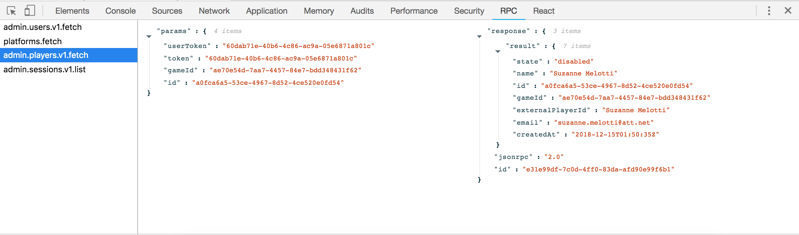

# RPC Network Tool

## About
The RPC Network Tool is an React Devtools extension optimized for inspecting RPC network requests

## Installation

1. `npm install`
2. `npm run build`
3. Visit `chrome://extensions/`, turn on Developer Mode, click the "Load Unpacked" button, and select the folder where you installed this repo
